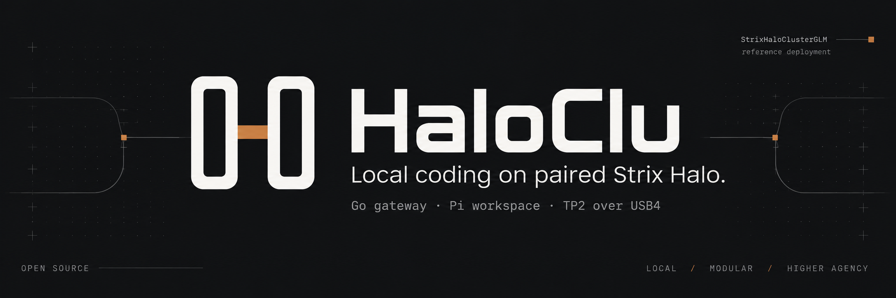
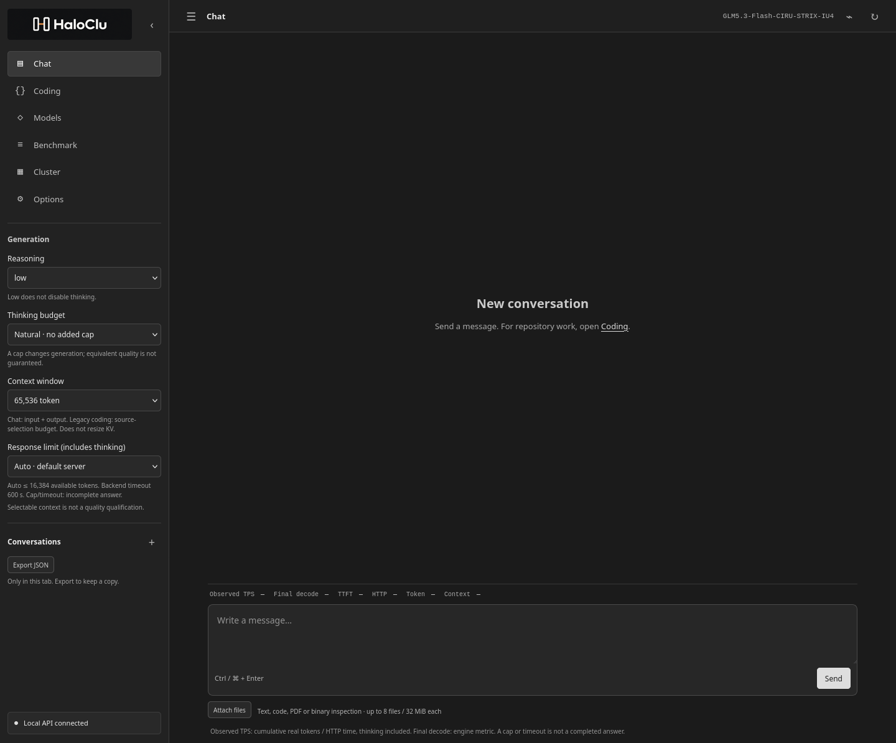
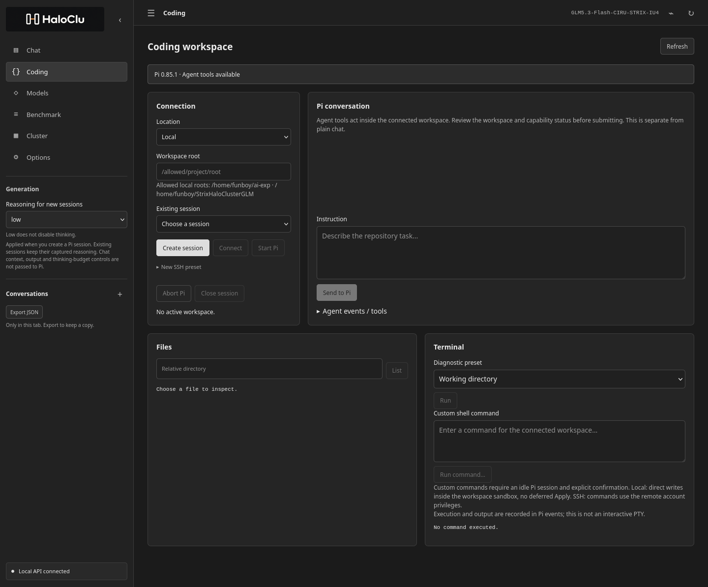
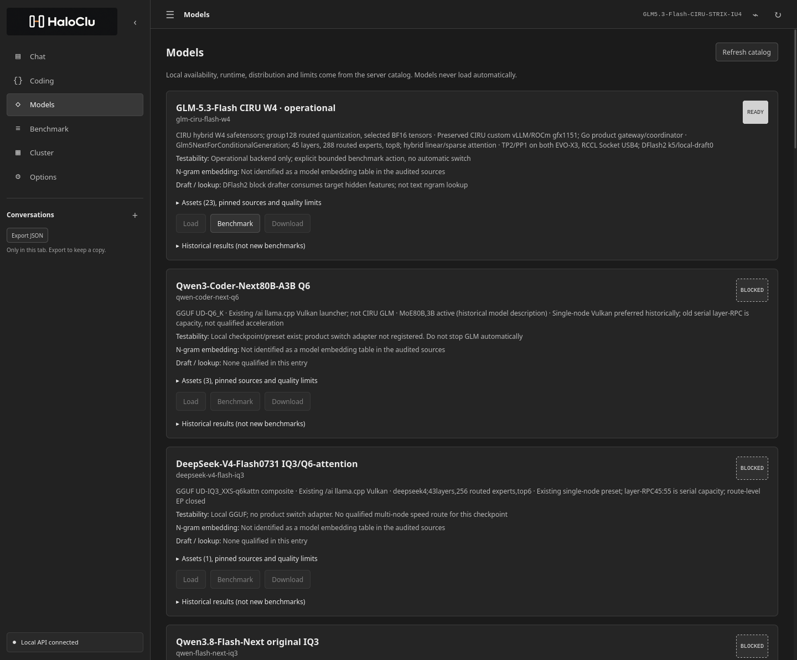
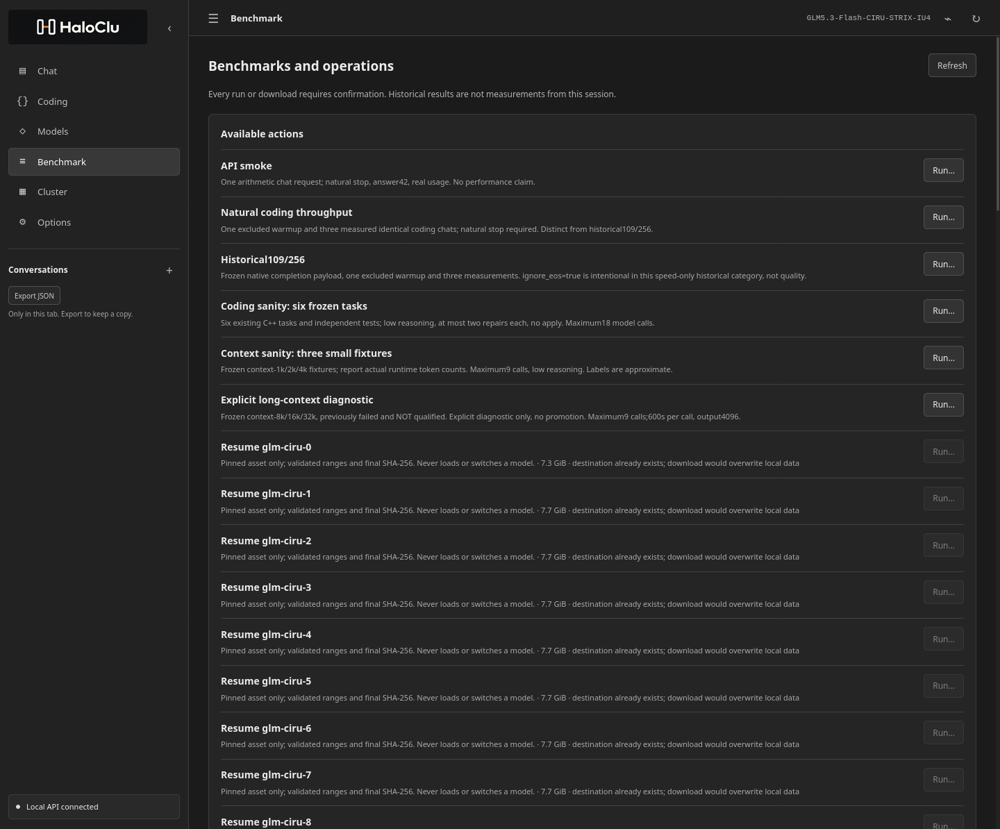
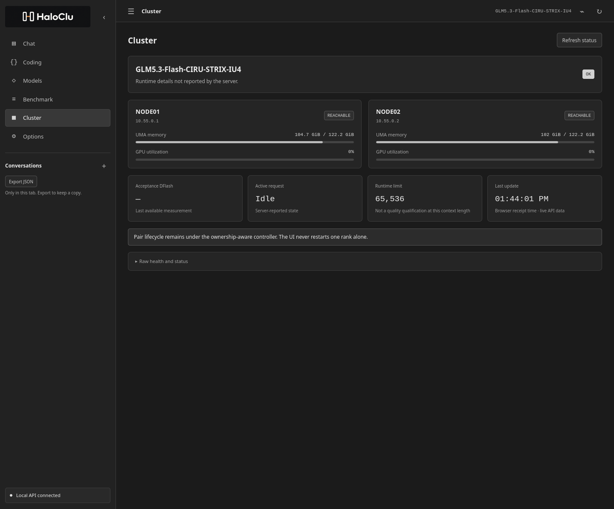
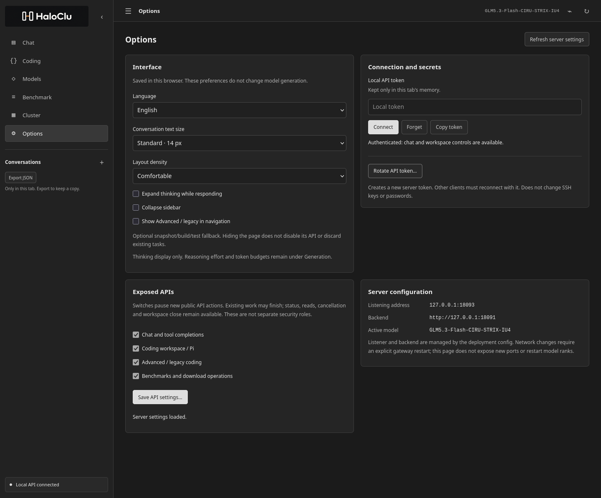

<p align="center">
  
</p>

<p align="center">
  <a href="#chat">Chat</a> ·
  <a href="#coding--pi">Coding / Pi</a> ·
  <a href="#models">Models</a> ·
  <a href="#benchmark">Benchmark</a> ·
  <a href="#cluster">Cluster</a> ·
  <a href="#options">Options</a>
</p>

**HaloClu** is a lightweight browser workspace for local chat, repository work
with the actual **Pi coding agent**, and inference operations on **two GMKtec
EVO-X3 / Strix Halo nodes**. The interface is grayscale, English by default,
with optional Italian. A Go gateway serves the UI and authenticated APIs;
there is no browser framework, CDN or frontend build step.

**StrixHaloClusterGLM** is this repository and its qualified GLM reference
deployment. HaloClu is the product name, independent of the served model.
Reusing the interface does not qualify another runtime or model.

Usable for **supervised daily coding**: review changes and run independent
tests. This is not a promise of error-free code, autonomous production work,
near-SOTA parity or qualified long-context coding.

## Start here

On the existing installation, open **http://127.0.0.1:18093/**. Under
**Options → Connection and secrets**, enter the local `state/api-token` and
select **Connect**. Tokens stay in tab memory, not browser storage.

- Choose **Chat** to discuss code, ask questions or inspect attached documents.
- Choose **Coding** to let Pi read, edit and run commands in a selected project.
- Choose **Models**, **Benchmark** or **Cluster** to inspect the installation
  and explicitly run supported operations. Browsing never starts a model test,
  download or model switch.

Generation controls appear only on relevant pages. Chat exposes its request
settings; Coding exposes the reasoning setting used when creating a Pi session.
Global display and connection preferences live in **Options**.

The six images below are browser captures, not generated UI mockups. Empty
conversations and idle panels are intentional: no sample answers, credentials
or invented measurements are inserted for presentation.

## Chat



Chat is for questions, explanations and proposed code, without giving an agent
write access to a repository. Responses support Markdown, tables, lists and
copyable code blocks. Thinking can stay collapsed or expand while responding;
that display preference does not change model computation.

| Request control | Meaning |
|---|---|
| Reasoning: `low`, `high`, `max` | Effort requested from the model; `low` is not thinking off |
| Thinking budget | Optional generation cap; zero forces reasoning closure, not proven equivalent quality |
| Context window | Total chat input + output admission budget; does not resize the engine's KV cache |
| Response limit | Maximum completion tokens, including thinking; Auto uses the server default within available space |

A larger context or response limit is not a quality guarantee. A cap or timeout
means **INCOMPLETE**, not a successfully concluded answer. Even a naturally
concluded answer needs factual checking and executable tests where applicable.

**Attach files** to inspect text, Markdown, source code, PDF text layers or DOCX
text. Archives provide listings; binaries provide bounded hex/strings inspection.
Scanned pages, visual diagrams and general multimodal understanding are not
supported by this text workflow. Extraction warnings remain visible: up to eight
files, 32 MiB per file, with bounded extracted content. An attachment does not
authorize executing it.

**Metrics retain their meaning.** Observed TPS uses real cumulative completion
tokens divided by HTTP elapsed time, thinking included. Final decode comes from
the engine; TTFT is browser-observed. These are different measurements, not
interchangeable rates. Unavailable metrics remain unavailable. **Stop stream**
stops browser reception; it is not a promise to cancel an already admitted
paired generation immediately.

Conversations live only in the current tab. Use **Export JSON** before reloading
or closing it. [Daily-use guide](docs/DAILY_USE.md) ·
[Frontend behavior](web/README.md).

## Coding / Pi



Coding runs **upstream Pi**, pinned to
`@earendil-works/pi-coding-agent` 0.85.1, through its RPC interface. It is not a
second home-built coding agent. Pi can inspect the selected repository, edit
files and invoke tools; actual agent and tool events are visible in the browser.

1. Start from a clean branch or disposable worktree. Choose **Local** or
   **Remote SSH** and a narrowly scoped project root.
2. Set reasoning before **Create session**. For SSH, select a saved host preset
   and explicitly **Connect**; local sessions connect to the allowed directory.
3. Select **Start Pi**. Startup does not send a model prompt. Wait for the
   session's ready/capability status.
4. Send a bounded instruction with expected behavior, files in scope and the
   project's test commands. Sending it authorizes Pi's available tools within
   that session.
5. Inspect the events and actual diff, run independent tests, then commit the
   reviewed result. **Abort Pi** and **Close session** control the workspace,
   never an individual inference rank.

**Pi writes directly to the workspace.** There is no deferred Apply button for
these changes. The hidden legacy workflow uses isolated snapshots and confirmed
patch application instead; it is a separate fallback, not Pi's execution model.

The current Pi integration takes **reasoning at session creation**. Chat's
context, response-limit and thinking-budget selectors do not configure Pi, so
they are not shown on this page. Changing the sidebar cannot reconfigure an
existing Pi process. Pi/tool requests remain subject to gateway/runtime limits;
this is not unlimited output or long-context qualification.

**Files** lists directories and reads bounded text. **Terminal** offers read-only
diagnostic presets plus an explicitly confirmed custom command when Pi is idle.
It shows recorded execution/output; it is **not an interactive PTY** or a full
browser IDE. Commands do not silently launch a model request.

**Local sessions** use a network-isolated bubblewrap sandbox and an owned
user-systemd scope: 2 GiB memory, no swap, 128 tasks and 200% CPU. Only the
selected project and private session/temp state are writable. These limits
protect the inference installation; large builds may exceed them. General
package downloads are unavailable inside the sandbox—prepare trusted
dependencies separately.

**Remote SSH** uses server-side saved host metadata and an existing agent,
private-key path or transient connect-time password. Key files and known hosts
belong to the gateway machine, not the browser's computer. Presets never store
passwords or key contents. Unknown/changed host keys fail closed. Remote tools
run with the SSH account's authority, **not** a remote sandbox; real-host remote
coding still needs qualification on the chosen host. Use a restricted account.

Tool-generating model turns are buffered until the paired results agree; the UI
does not pretend those events are live token streaming. Ordinary Chat remains
streamed. [Pi setup, isolation and API contract](WORKSPACES.md) ·
[Safe daily workflow](docs/DAILY_USE.md).

## Models



The catalog puts the operational configuration first and records other models'
formats, runtime compatibility, artifacts, historical results and blockers.
Local size checks are distinguished from checksum verification; remote files
are not silently revalidated just by opening the page. **Present on disk** is
not the same as **loadable**, **qualified** or **active**.

Architecture notes explain why techniques are not interchangeable. For example,
Qwen Flash-Next's **PLE/ngram embedding table is part of the target model**;
speculative ngram lookup is a separate token-history mechanism. GLM's DFlash2
uses target hidden features, not that embedding table or text lookup. A GGUF
layer-RPC path is not the same distribution as CIRU's safetensors TP2, and serial
capacity splitting must not be called parallel acceleration.

Supported downloads require an explicit pinned asset selection and confirmation;
the downloader resumes partial transfers and verifies the completed artifact.
Opening a model card never downloads weights, migrates formats or switches the
active pair. Unsupported actions stay blocked with a reason.
[Pinned catalog](runtime/model-catalog.json) · [Engine recipe](runtime/README.md).

## Benchmark



Benchmark exposes existing allowlisted operations: API smoke, natural coding
throughput, the frozen historical 109/256 workload, compact coding checks and
explicit context diagnostics. Each action shows its scope and requires
confirmation; progress, failures and raw evidence remain inspectable.

Natural-completion and historical fixed-length speed tests are separate
categories. The historical speed payload intentionally ignores EOS; that is
not a completed-answer quality test. Existing throughput figures are labelled
historical, not presented as fresh measurements. Long-context diagnostics do
not become qualified just because the UI offers the test. Running these actions
uses the model and should be deliberate, not a background activity.
[Harnesses and prerequisites](benchmarks/README.md) ·
[Qualification and negative results](QUALIFICATION.md).

## Cluster



Cluster displays the available paired health, activity and telemetry from the
current installation. It distinguishes the configured model and retained
runtime evidence from what is currently responding. Missing measurements are
not filled in with estimates or zeroes.

This is an inspection page, not an independent rank-control panel. The preserved
ownership-aware lifecycle operates on the whole pair; UI navigation cannot
restart one rank or change weights, kernels or drivers.
[Whole-pair operations and rollback](runtime/OPERATIONS.md).

## Options



Options holds settings shared across pages: English/Italian, text size, density,
thinking display and sidebar behavior. **Advanced / legacy is hidden by
default**; enable its interface option only when you need the older isolated
snapshot → build/test → repair → confirmed Apply workflow. Hiding it changes
navigation, not API authorization or existing task state.

Connection controls let you connect, forget the tab's credential, copy it or
explicitly rotate the gateway token. Rotation invalidates the old token for
new requests; other clients must reconnect. It does not change SSH passwords,
keys or inference-rank ownership. Do not expose tokens in screenshots or issues.

Server API switches pause **new** Chat, Pi workspace, legacy coding or
benchmark/download actions. They do not cancel admitted work, revoke a running
agent or act as a firewall. Listen address, backend and model identity are
informational; changing network configuration requires a controlled server
change, not a browser toggle. [Exact Options semantics](docs/OPTIONS.md).

## Reference configuration and evidence

| Component | Recorded configuration |
|---|---|
| Machines | 2 × GMKtec EVO-X3, Ryzen AI Max+395, Radeon 8060S |
| Memory | 128 GB UMA per node; 256 GB total, not one shared address space |
| Target | GLM5.3-Flash-CIRU-STRIX-IU4, hybrid W4 |
| Distribution | TP2 / PP1, RCCL Socket over USB4 |
| Drafting | DFlash2, k5, local-draft0 |
| Browser / API | Loopback port 18093; Bearer authentication |

The retained 109-input/256-output workload measured **24.851 decode TPS** and
**23.667 HTTP TPS**. These are workload-specific reference measurements, not
promises for every task or new measurements from these screenshots.
[Runtime pins](runtime/manifest.json) ·
[Reference deployment](docs/REFERENCE_DEPLOYMENT.md).

The original isolated coding workflow passed ten compact C++ repository tasks
(nine first-pass, one repaired). The real Pi integration delivered **one C
task** whose unedited code passed 213 independent cases: that is one problem,
not 213 coding tasks. Audited `low` and `max` chat answers also contained real
bugs. Keep both positive and negative evidence in view.
[Full qualification scope](QUALIFICATION.md).

## Build and deployment

This source targets the recorded installation. It is **not yet a one-command
installer for a fresh machine**: the external inference environment, weights,
tools and host paths must be provisioned explicitly. No model weights are
included. Adapt the reference paths before deploying elsewhere.

```sh
make build                  # Go 1.27.1; no model download
./bin/strixglm serve --config config.json
```

Do not start a second gateway on an occupied port. Pi needs its pinned
Node/package installation, bubblewrap and working user-systemd scopes.
[Workspace prerequisites](WORKSPACES.md) ·
[Deployment recipe](runtime/README.md).

```text
cmd/strixglm/     Executable entry point
internal/app/    Gateway, paired controller, Pi integration and Go tests
web/             Browser assets and dependency-free tests
runtime/         Engine pins, patches, model catalog and Pi adapters
benchmarks/      Explicit qualification and regression scripts
docs/            Product, deployment and operational documentation
```

[Source boundaries](docs/ARCHITECTURE.md). Hosted CI checks compilation,
selected CPU-only protocol fixtures and browser logic; it neither runs a GPU
nor qualifies model intelligence.

## Security, source and contributions

Keep the gateway private; use an SSH tunnel for remote browser access. Passwords,
API tokens, uploads, conversations, weights and machine state are excluded from
Git. Review diffs before publishing any local evidence.

The repository is public; **a license for original project code has not yet
been selected**. Public availability and the supplied artwork are not a license
grant. Third-party components retain their documented licenses.

[Security](SECURITY.md) · [Contributing](CONTRIBUTING.md) ·
[Third-party notices](THIRD_PARTY_NOTICES.md) ·
[Publication scope](docs/PUBLICATION.md) · [Roadmap](docs/ROADMAP.md).
