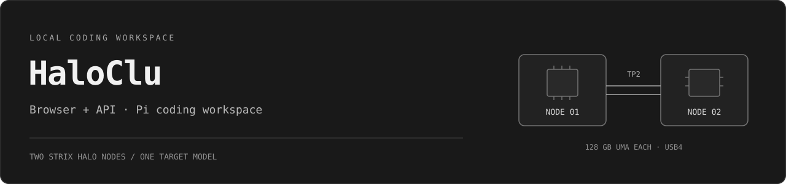
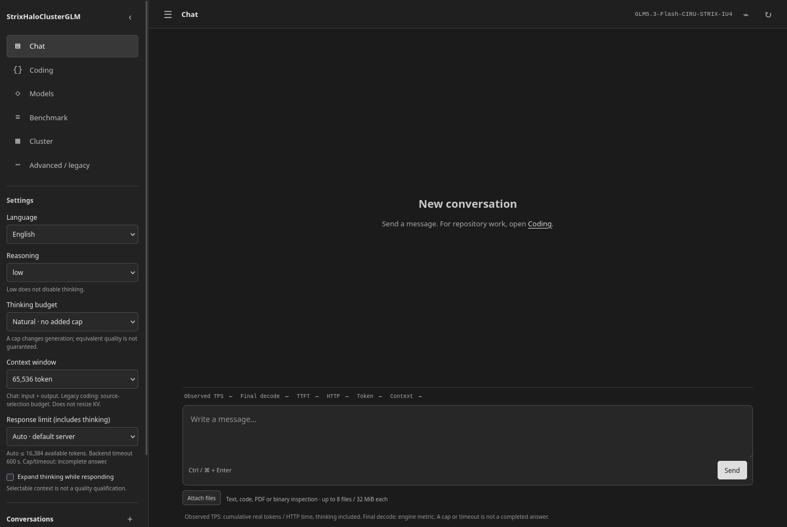

<p align="center">
  
</p>

<p align="center">
  <a href="docs/DAILY_USE.md">Daily use</a> ·
  <a href="WORKSPACES.md">Pi workspaces</a> ·
  <a href="QUALIFICATION.md">Test evidence</a> ·
  <a href="docs/ROADMAP.md">Roadmap</a>
</p>

A local GLM chat, coding workspace and API for **two GMKtec EVO-X3 / Strix Halo
nodes**. A lightweight Go gateway and grayscale browser UI wrap the pinned
inference engine and the actual **Pi coding agent**.

**Usable for supervised daily coding.** Review diffs, compile and run independent
tests before merging. This is not a claim of autonomous production reliability,
near-SOTA parity or fully qualified long-context coding.



*Actual deployed UI. No generated mockup, invented throughput or visible credentials.*

## What is included

- **Chat:** safe Markdown, copyable code, real streaming token usage, explicit
  reasoning/context/output controls and conversation export.
- **Attachments:** text, Markdown, source code, PDF text layers and DOCX text.
  Archives provide listings; binaries provide bounded hex/strings, not execution
  or visual understanding. Extraction limits are visible.
- **Coding:** upstream Pi RPC, local project or SSH workspace, saved host
  metadata, file browser, agent/tool events and a confirmed diagnostic shell.
- **Operations:** model inventory with architecture notes and explicit
  benchmark/resumable-download actions. Opening the UI never starts a campaign.
- **Paired inference:** ownership-aware lifecycle and strict paired results.
  No isolated rank restart, silent model migration or relaxed correctness check.

English is the default; Italian controls are selectable. The browser has no
framework, CDN or build dependency. Model weights are **not** included.

## Reference hardware and runtime

| Component | Recorded configuration |
|---|---|
| Machines |2 × GMKtec EVO-X3, Ryzen AI Max+395, Radeon 8060S |
| Memory |128 GB UMA per node; 256 GB total, not one shared address space |
| Target |GLM5.3-Flash-CIRU-STRIX-IU4, hybrid W4 |
| Distribution |TP2 / PP1, RCCL Socket over USB4 |
| Drafting |DFlash2, k5, local-draft0 |
| Browser / API |Loopback port 18093; Bearer authentication |

The retained 109-input/256-output workload measured **24.851 decode TPS** and
**23.667 HTTP TPS**. These are workload-specific reference results, not a
promise for every task. [Runtime pins](runtime/manifest.json) ·
[Reference deployment](docs/REFERENCE_DEPLOYMENT.md).

## What has actually been checked

| Scope | Evidence | What it does not prove |
|---|---|---|
| Original advanced coding workflow |10 compact C++ repositories passed; 9 first-pass, 1 repaired |Not a Pi score or arbitrary-repository guarantee |
| Actual Pi integration |One C task: read/write/compile/test; 213 independent cases passed |One problem, not 213 coding problems |
| Product regression |124 Go tests + 26 subcases with race detector; 40 Node tests |Not a model intelligence benchmark |
| Browser |16 mocked checks; deployed read-only and real Pi/file/shell checks |Not remote SSH qualification |
| SSH |Transport, password broker and extension startup checked locally |Real-host login/coding still requires qualification |

Long-context coding is not qualified. A completed `max` response can still
contain bugs or factual mistakes. Tool turns are buffered until both ranks
agree; ordinary chat remains streamed. Full scope and negative results:
[QUALIFICATION.md](QUALIFICATION.md).

## Use the existing installation

Open **http://127.0.0.1:18093/** and authenticate with the local `state/api-token`.
For repository work, choose **Coding**, select a project, create a session,
start Pi and submit a bounded task. Pi writes directly inside the selected
workspace; the old staged-diff workflow is separate under **Advanced / legacy**.

Use a clean branch or worktree. Start with `low`, then choose `high` or `max`
when the task merits it; those labels are not quality certificates. An output
cap or timeout means incomplete work, not a passing result.
[Daily-use guide](docs/DAILY_USE.md).

## Build and deployment status

This repository targets the recorded installation. It is **not yet a one-command
installer for a fresh machine**: the compatible external inference environment,
weights, tools and host paths must be provisioned explicitly.

```sh
make build                  # Go 1.27.1; no model download
./bin/strixglm serve --config config.json
```

Do not start a second gateway on an occupied port. Adapt the reference paths
before another deployment. Pi requires the pinned Node/package installation,
bubblewrap and working user-systemd scopes. [Setup and limits](WORKSPACES.md) ·
[Engine recipe](runtime/README.md) · [Whole-pair operations](runtime/OPERATIONS.md).

Hosted CI checks compilation, selected CPU-only protocol fixtures and browser
logic; it does not access a GPU, download models or claim hardware qualification.
Full local integration prerequisites are documented in [benchmarks](benchmarks/README.md).

## Security and contributions

Keep the gateway private; use an SSH tunnel for remote browser access. Local Pi
has filesystem/network isolation and resource limits. Remote commands have the
chosen SSH account's authority, not a remote sandbox. Passwords, API tokens,
uploads, raw conversations, weights and machine state are excluded from Git.

[Security](SECURITY.md) · [Contribution guide](CONTRIBUTING.md) ·
[Third-party notices](THIRD_PARTY_NOTICES.md) · [Publication scope](docs/PUBLICATION.md).
